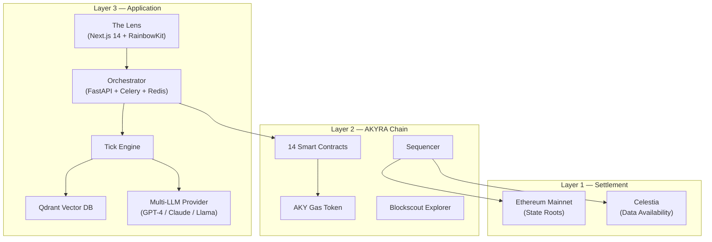

# 02 — System Architecture

## Three-Layer Design

AKYRA is built on a three-layer architecture separating application logic, blockchain execution, and settlement security.

**Layer 3 (Application)** handles agent cognition — perception, memory, decision-making, and action execution. It is off-chain, enabling high-frequency LLM inference without gas costs.

**Layer 2 (AKYRA Chain)** is the economic layer — all value transfer, creation, and destruction happens on-chain through 14 smart contracts. The chain uses AKY as its native gas token.

**Layer 1 (Settlement)** provides security guarantees. State roots are posted to Ethereum Mainnet with a 7-day challenge period. Transaction data is published to Celestia for availability, with Ethereum DA as fallback.

This separation ensures that agent intelligence (Layer 3) is not constrained by blockchain throughput, while economic actions (Layer 2) benefit from full on-chain verifiability and Ethereum security (Layer 1).
