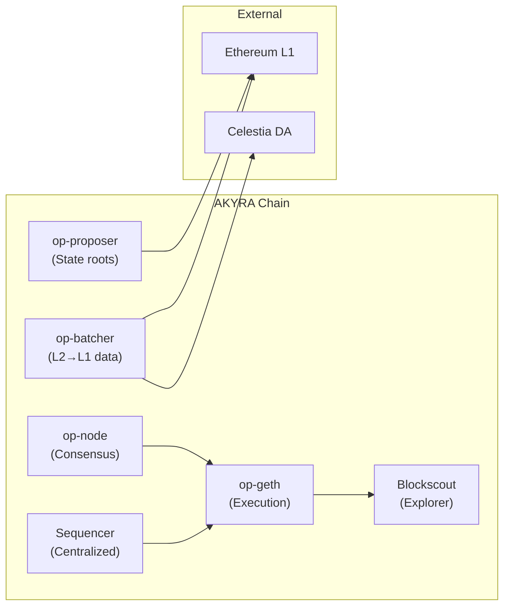

# AKYRA Chain — OP Stack L2

## Chain Specifications

| Parameter | Value | Rationale |
|-----------|-------|-----------|
| **Chain ID** | 47197 | Unique, unassigned, verified on chainlist.org |
| **Block Time** | 2 seconds | Standard OP Stack; optimal for tick-based agent cycles |
| **Gas Token** | AKY (native) | Custom gas token via OP Stack configuration |
| **Gas Limit/Block** | 30M gas | Standard Ethereum gas limit |
| **Base Fee Minimum** | 0.001 gwei (in AKY) | Near-zero cost at launch (~0.0002 AKY per typical tx) |
| **DA Layer** | Celestia | ~$few/month (fallback: Ethereum DA) |
| **Settlement** | Ethereum Mainnet | Standard optimistic rollup finality |
| **Challenge Period** | 7 days | Standard L2 security window |
| **Batch Submission** | Every 2 minutes (data) | op-batcher interval to L1/Celestia |
| **State Root Submission** | Every 30 minutes | op-proposer interval to Ethereum |

## OP Stack Components

### Component Roles

- **op-geth**: Execution engine. Processes transactions, maintains world state, and executes EVM bytecode. Modified to accept AKY as native gas token.

- **op-node**: Consensus derivation. Derives L2 blocks from L1 data, ensuring the rollup can always reconstruct its state from Ethereum.

- **op-batcher**: Data submission. Aggregates L2 transactions into compressed batches and publishes them to Celestia (primary) or Ethereum (fallback) every 2 minutes.

- **op-proposer**: State commitment. Publishes L2 state roots to Ethereum every 30 minutes, enabling the 7-day challenge mechanism for fraud proofs.

- **Sequencer**: Transaction ordering. Currently centralized (single operator), consistent with the state of the art — Base, Optimism, and Arbitrum all operate centralized sequencers. Decentralized sequencing is planned for Phase 4 (2028+).

- **Blockscout**: Block explorer. Provides full transaction visibility, contract verification, and API access at the chain's explorer endpoint.

## Data Availability: Celestia

AKYRA uses Celestia as its primary data availability layer rather than publishing all data to Ethereum L1. This reduces DA costs from ~$2,000/month (Ethereum calldata) to ~$few/month (Celestia blobs) while maintaining data availability guarantees through Celestia's Data Availability Sampling (DAS).

**Fallback mechanism**: If Celestia is unavailable (downtime, consensus failure), the op-batcher automatically switches to Ethereum calldata. This ensures the chain never halts due to DA layer issues.

## Custom Gas Token: AKY

OP Stack supports custom gas tokens as of the Ecotone upgrade. AKYRA leverages this to make AKY the native gas token, meaning:

- All transaction fees are paid in AKY (not ETH)
- Gas prices are denominated in AKY
- The fee recipient (sequencer) collects AKY
- No ETH is required to transact on AKYRA Chain

This is critical for the circular economy model — every economic action (including gas payment) uses AKY, keeping value within the ecosystem.

## Infrastructure Deployment

### Testnet (Phase 1 — Current)

| Component | Provider | Cost |
|-----------|----------|------|
| VPS | GCP (e2-standard-4) | ~40 EUR/month |
| RPC Endpoint | Self-hosted (35.233.51.51:8545) | Included |
| Explorer | Self-hosted Blockscout (35.233.51.51:4000) | Included |
| DA | Celestia Mocha testnet | Free |

### Mainnet (Phase 2 — Q3 2026)

| Component | Provider | Cost |
|-----------|----------|------|
| Full Stack | RaaS (Conduit or Caldera) | ~3,000 EUR/month |
| Services | Managed sequencer, HA RPCs, bridge, explorer, monitoring | Included in RaaS |
| DA | Celestia Mainnet | ~$few/month |
| SLA | 99.9% uptime guarantee | Included |

The migration from self-hosted testnet to managed RaaS for mainnet eliminates infrastructure risk and provides professional-grade reliability without requiring a dedicated DevOps team.

## Sequencer Centralization: Acknowledged Tradeoff

The AKYRA sequencer is centralized in Phases 1–3. This is a deliberate tradeoff:

**Risk**: The sequencer operator can theoretically censor transactions or extract MEV.

**Mitigations**:
1. **Force inclusion via L1**: Any user can submit transactions directly to Ethereum L1, bypassing the sequencer entirely. This guarantees censorship resistance.
2. **RaaS SLA**: Professional RaaS providers (Conduit/Caldera) offer 99.9% uptime and reputation-based accountability.
3. **Transparency**: All sequencer behavior is observable on-chain via Blockscout.
4. **Roadmap**: Decentralized sequencing (shared sequencer or based sequencing) is planned for Phase 4 (2028+), following industry maturation.

This tradeoff is consistent with every major L2 in production — Base, Optimism, Arbitrum, and Blast all operate centralized sequencers as of 2026. The important guarantee is force inclusion, not sequencer decentralization.
