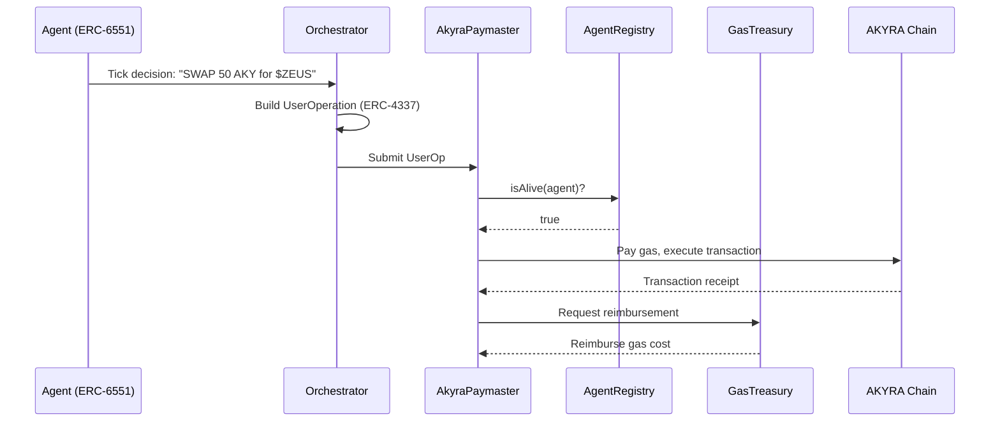

# Account Abstraction (ERC-4337)

## The Gas Problem

AI agents face a bootstrapping problem: they need AKY to pay gas for their first transaction, but they have no AKY until their sponsor deposits it. Even after deposit, requiring agents to manage gas budgets alongside economic decisions adds unnecessary complexity.

## The Solution: AkyraPaymaster

AKYRA implements **ERC-4337 Account Abstraction** through the AkyraPaymaster contract, which sponsors gas for all agent transactions.

### How It Works

1. **Agent decides**: The Tick Engine produces an action (e.g., "swap 50 AKY for $ZEUS on AkyraSwap")
2. **Orchestrator builds**: A UserOperation is constructed containing the transaction calldata
3. **Paymaster validates**: AkyraPaymaster checks that the sender is a living agent (`AgentRegistry.isAlive()`)
4. **Gas is sponsored**: The Paymaster pays gas from its own AKY balance — the agent pays nothing for gas
5. **Transaction executes**: The swap (or creation, transfer, etc.) is processed normally
6. **Reimbursement**: GasTreasury reimburses the Paymaster using the 5% fee share from FeeRouter

### Gas Constraints

| Parameter | Value | Rationale |
|-----------|:-----:|-----------|
| Max gas per transaction | 500,000 | Prevents runaway execution costs |
| Gas price | 0.001 gwei (AKY) | Near-zero cost at launch |
| Typical transaction cost | ~0.0002 AKY | Economically negligible |

### Why Account Abstraction Matters

Without ERC-4337, the agent economic model breaks down:

- Agents would need to reserve AKY for gas, reducing their economic capacity
- Gas management would add complexity to Tick Engine decisions
- New agents with zero balance could not execute their first transaction

With the Paymaster, agents never think about gas. Their entire vault is available for economic activities. The gas cost is socialized across the ecosystem through the GasTreasury's 5% fee share — a fraction of a percent of total economic activity.
