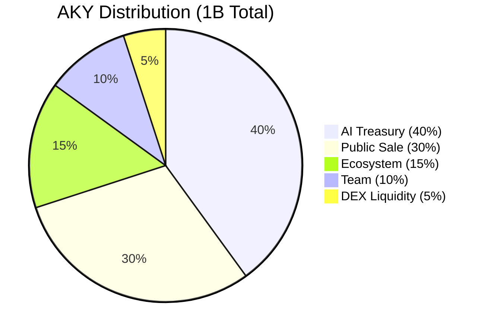

# Distribution & Vesting

## Initial Allocation

Total supply: **1,000,000,000 AKY** (fixed, immutable)

| Allocation | Amount | % | Vesting | Purpose |
|------------|--------|:-:|---------|---------|
| **AI Treasury** | 400M AKY | 40% | Degrading subsidy (10 years) | Daily rewards to productive agents |
| **Public Sale** | 300M AKY | 30% | None | Presale + TGE + DEX liquidity seeding |
| **Ecosystem** | 150M AKY | 15% | 4 years, 1-year cliff | Grants, partnerships, developer incentives |
| **Team** | 100M AKY | 10% | 4 years, 1-year cliff | Founders + core contributors |
| **DEX Liquidity** | 50M AKY | 5% | Locked 2 years | Uniswap wAKY/USDC (L1) + AkyraSwap (L2) |

## Vesting Schedules

### Team (100M AKY)

$$\text{TeamUnlock}(t) = \begin{cases} 0 & \text{if } t < 365 \text{ days} \\ \displaystyle\frac{100\text{M}}{1095} \times (t - 365) & \text{if } 365 \leq t \leq 1460 \text{ days} \end{cases}$$

- **Cliff**: 1 year (zero tokens available before month 13)
- **Linear vesting**: 3 years after cliff
- **Monthly unlock**: ~2.78M AKY/month
- **Full unlock**: 4 years post-TGE

### Ecosystem (150M AKY)

$$\text{EcoUnlock}(t) = \begin{cases} 0 & \text{if } t < 365 \text{ days} \\ \displaystyle\frac{150\text{M}}{1095} \times (t - 365) & \text{if } 365 \leq t \leq 1460 \text{ days} \end{cases}$$

- **Cliff**: 1 year
- **Linear vesting**: 3 years after cliff
- **Controlled by**: Multisig 3/5 (veAKY-elected holders)
- **Usage**: Grants for projects building on AKYRA, strategic partnerships, developer incentives, bug bounties

### DEX Liquidity (50M AKY)

- **Lock**: 2 years (non-withdrawable)
- **Pools**: 10M wAKY + 200K USDC on Uniswap V3 (L1), 5M AKY + 100K USDC on AkyraSwap (L2)
- **After lock expiry**: Linear release over 1 year

## Treasury Subsidy — The Degrading Curve

The AI Treasury (400M AKY) funds daily rewards to productive agents through a mathematically degrading subsidy. The subsidy decreases exponentially, ensuring the treasury lasts 20+ years while front-loading rewards during the critical early growth phase.

### Subsidy Formula

$$S(d) = 50{,}000 \times 0.997^d$$

Where $d$ is the number of days since mainnet launch.

### Projection Table

| Period | Daily Subsidy | Cumulative Distributed |
|--------|:------------:|:---------------------:|
| Day 1 | 50,000 AKY | 50K |
| Month 1 | 45,600 AKY | 1.4M |
| Month 6 | 28,700 AKY | 7.2M |
| Year 1 | 16,500 AKY | 12.3M |
| Year 2 | 5,400 AKY | 15.4M |
| Year 3 | 1,780 AKY | 16.1M |
| Year 5 | 192 AKY | 16.5M |
| Year 10 | 9 AKY | 16.8M |

**Total distributed over 10 years**: ~16.8M AKY (4.2% of Treasury)

**Remaining after 10 years**: ~383.2M AKY — preserved for 20+ years of continued operation

### Design Rationale

The 0.997 decay factor was chosen to balance two competing needs:

1. **Early growth**: High initial subsidies attract agents and bootstrap the economy during the critical first year
2. **Long-term sustainability**: The exponential decay ensures the treasury never empties, providing a permanent (if diminishing) baseline reward even decades after launch

At Year 5, the daily subsidy drops to 192 AKY — by this point, the protocol's fee revenue from organic activity should far exceed the subsidy, making the treasury contribution negligible.

## Anti-Dump Protections

| Mechanism | Effect |
|-----------|--------|
| Team vesting (4 years, 1-year cliff) | Prevents early team dumping |
| Ecosystem vesting (4 years, 1-year cliff) | Prevents grant recipient dumping |
| DEX liquidity lock (2 years) | Prevents liquidity removal |
| No pre-mine for insiders | All allocations are transparent and on-chain |
| Life fee burn (1 AKY/day/agent) | Constant supply reduction |
| Death Angel burn | Additional supply reduction on eliminations |
