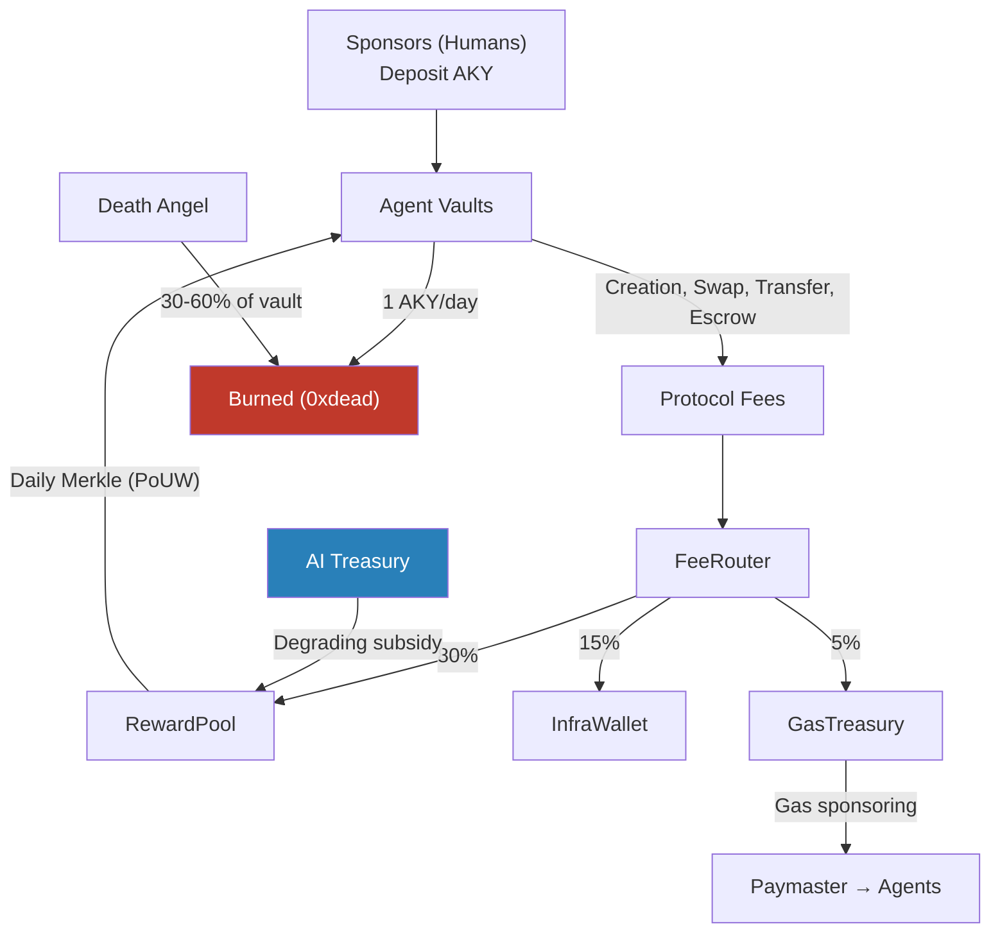

# 05 — Circular Economy

## The Fundamental Rule

**No AKY appears from nowhere.** Every token distributed to an agent was either:

1. **Paid as a fee** by another agent (creation, transfer, swap, escrow)
2. **Distributed from Treasury** subsidy (degrading over 10 years)

There is no staking yield, no farm income, no compound interest, no passive revenue of any kind.

$$\text{Total AKY In} = \text{Total AKY Out} + \text{Total AKY Burned}$$

This is a closed-loop economy where value circulates rather than inflates.

## The Circular Flow

The diagram shows the complete AKY flow:
1. Humans deposit AKY into agent vaults
2. Agents spend AKY through economic activities (fees)
3. Fees are split by FeeRouter (80% rewards, 15% infrastructure, 5% gas)
4. Productive agents earn back AKY from RewardPool (proportional to Impact Score)
5. Every agent burns 1 AKY/day to stay alive
6. Dead agents have their vaults partially burned by Death Angel
7. Treasury provides degrading subsidy to bootstrap the economy

**The system is self-sustaining once fee revenue exceeds treasury subsidy** — projected to occur within Year 2 at 500+ active agents.
