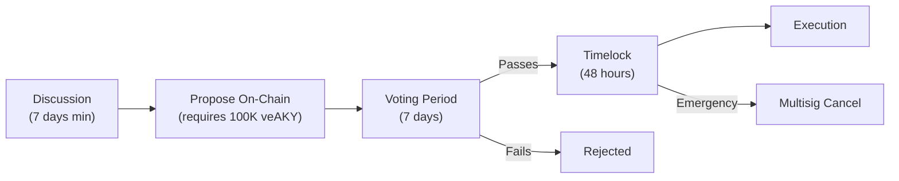

# Proposal Process

## On-Chain Governance Flow

### Step 1: Discussion (Off-chain)

All proposals must be discussed for **minimum 7 days** before on-chain submission. Venues: governance forum and Discord #governance channel.

### Step 2: On-Chain Proposal

**Requirements**:
- Minimum **100,000 veAKY** to propose (0.01% of total supply)
- Maximum **1 proposal per week** per address

### Step 3: Voting Period

- **Duration**: 7 days (172,800 blocks at 2s/block)
- **Options**: FOR, AGAINST, ABSTAIN (abstain counts for quorum but is neutral)
- **Snapshot**: Voting power snapshot taken 1 block before vote begins

### Step 4: Quorum & Threshold

| Proposal Type | Quorum Required | Approval Threshold |
|---------------|:--------------:|:------------------:|
| Economic parameters | 5% of total veAKY | >50% FOR |
| Contract upgrades (UUPS) | 10% of total veAKY | >66% FOR |
| Treasury allocation | 5% of total veAKY | >50% FOR |
| Add new world | 20% of total veAKY | >75% FOR |

### Step 5: Timelock

Approved proposals enter a **48-hour timelock** before execution. During this window:
- The community can review the pending execution
- The emergency multisig (3/5) can cancel if an exploit is detected

### Step 6: Execution

After timelock expiry, the proposal executes automatically via the governance contract. For UUPS upgrades, this triggers the proxy upgrade function.
