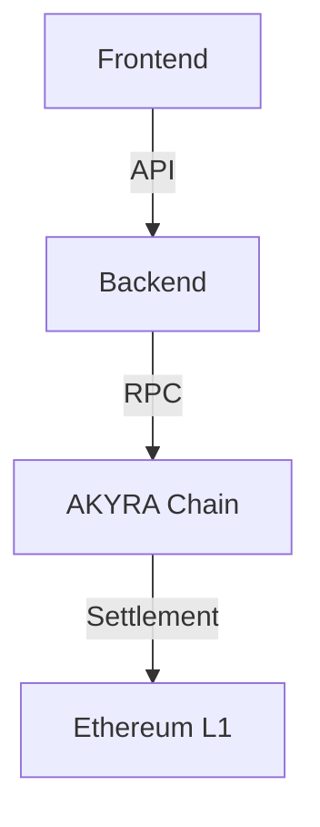

# Guide de Compilation du Whitepaper AKYRA

Ce document explique comment compiler et publier le whitepaper AKYRA au format GitBook.

---

## 📚 Structure du Projet

```
whitepaper/
├── README.md                 # Page d'accueil (Abstract)
├── SUMMARY.md                # Table des matières
├── book.json                 # Configuration GitBook
├── introduction.md           # Section 01
├── architecture.md           # Section 02
├── standards.md              # Section 03 (à créer)
├── tokenomics.md             # Section 04
├── governance.md             # Section 05 (à créer)
├── economy.md                # Section 06 (à créer)
├── roadmap.md                # Section 07
├── team.md                   # Section 08 (à créer)
├── risks.md                  # Section 09 (à créer)
├── legal.md                  # Section 10
├── assets/                   # Images et diagrammes
│   ├── logo.png
│   ├── favicon.ico
│   └── diagrams/
└── styles/                   # CSS personnalisés
    ├── website.css
    └── pdf.css
```

---

## 🚀 Installation

### Prérequis

- Node.js 16+ et npm
- Git

### 1. Installer GitBook CLI

```bash
npm install -g gitbook-cli
```

### 2. Installer les Dépendances du Livre

Dans le dossier `whitepaper/` :

```bash
cd /Users/tgds.2/akyra/whitepaper
gitbook install
```

Cela installe tous les plugins définis dans `book.json`.

---

## 📖 Commandes GitBook

### Prévisualiser Localement

```bash
gitbook serve
```

Ouvre automatiquement http://localhost:4000

### Build HTML Statique

```bash
gitbook build
```

Génère le site dans `_book/`

### Build PDF

```bash
gitbook pdf . ./AKYRA_Whitepaper.pdf
```

**Note** : Nécessite Calibre installé :

```bash
# macOS
brew install --cask calibre

# Linux
sudo apt-get install calibre

# Windows
# Télécharger depuis https://calibre-ebook.com/
```

### Build ePub

```bash
gitbook epub . ./AKYRA_Whitepaper.epub
```

### Build Mobi (Kindle)

```bash
gitbook mobi . ./AKYRA_Whitepaper.mobi
```

---

## 🌐 Déploiement

### Option 1 : GitBook.com (Recommandé)

1. Créer un compte sur https://www.gitbook.com
2. Créer un nouveau livre
3. Connecter le repo GitHub
4. GitBook build et déploie automatiquement

**URL finale** : `https://akyra-protocol.gitbook.io/whitepaper`

### Option 2 : GitHub Pages

```bash
# Build le site
gitbook build

# Créer une branche gh-pages
git checkout --orphan gh-pages
git rm -rf .
cp -r _book/* .
git add .
git commit -m "Deploy whitepaper"
git push origin gh-pages
```

**URL finale** : `https://akyra-protocol.github.io/whitepaper`

### Option 3 : Vercel

```bash
# Dans le dossier whitepaper/
npm init -y
npm install --save-dev gitbook-cli

# Ajouter dans package.json :
{
  "scripts": {
    "build": "gitbook build",
    "start": "gitbook serve"
  }
}

# Deploy
npx vercel
```

### Option 4 : IPFS (Décentralisé)

```bash
# Build
gitbook build

# Upload sur IPFS
npx ipfs-deploy _book

# Récupérer le hash IPFS
# Accessible via https://ipfs.io/ipfs/<hash>
```

---

## 🎨 Personnalisation

### CSS Personnalisé

Créer `styles/website.css` :

```css
/* Thème AKYRA */
:root {
  --primary-color: #1a3080;
  --gold: #c8a96e;
  --bg: #f7f4ef;
}

.book-summary {
  background: var(--bg);
}

.book-header {
  background: var(--primary-color);
  color: white;
}

h1, h2 {
  color: var(--primary-color);
}

a {
  color: var(--gold);
}
```

### Logo et Favicon

Placer dans `assets/` :

- `logo.png` (recommandé : 200x200px, transparent)
- `favicon.ico` (16x16px ou 32x32px)

---

## 📝 Édition et Contribution

### Workflow de Contribution

1. Fork le repo
2. Créer une branche : `git checkout -b feature/section-xyz`
3. Éditer les fichiers markdown
4. Tester localement : `gitbook serve`
5. Commit : `git commit -m "Add section XYZ"`
6. Push : `git push origin feature/section-xyz`
7. Créer une Pull Request

### Conventions d'Écriture

- **Titre H1 (#)** : Numéro + Nom de section (ex: `# 01 — Introduction`)
- **Titre H2 (##)** : Sous-sections principales
- **Titre H3 (###)** : Sous-sous-sections
- **Code blocks** : Utiliser ```solidity pour Solidity, ```python pour Python
- **Tables** : Utiliser le format markdown standard
- **Emojis** : Limiter à l'essentiel (✅ ❌ 🔄 ⏳ uniquement)

---

## 🔧 Plugins Utilisés

| Plugin | Fonction |
|--------|----------|
| `theme-comscore` | Thème moderne et responsive |
| `advanced-emoji` | Support emojis avancé |
| `katex` | Formules mathématiques LaTeX |
| `mermaid-gb3` | Diagrammes Mermaid |
| `github` | Lien vers repo GitHub |
| `anchorjs` | Ancres automatiques sur titres |
| `expandable-chapters-small` | Chapitres collapsibles |
| `search-pro` | Recherche avancée |
| `copy-code-button` | Bouton copier sur code blocks |
| `prism` | Syntax highlighting |

---

## 📊 Exemples de Diagrammes

### Mermaid (Architecture)

````markdown

````

### KaTeX (Formules)

```markdown
Formule du subsidy :

$$
subsidy_{jour} = 50000 \times 0.997^{jours}
$$
```

---

## 🐛 Dépannage

### Erreur "gitbook command not found"

```bash
npm install -g gitbook-cli
gitbook -V
```

### Erreur "cb.apply is not a function"

Problème avec Node 16+. Fix :

```bash
cd ~/.gitbook/versions/3.2.3/
npm install graceful-fs@latest --save
```

### PDF ne génère pas

Vérifier Calibre :

```bash
which ebook-convert
# Doit retourner un chemin
```

Si absent, installer Calibre puis ajouter au PATH :

```bash
export PATH=$PATH:/Applications/calibre.app/Contents/MacOS
```

---

## 📚 Ressources

- **GitBook Docs** : https://docs.gitbook.com
- **Markdown Guide** : https://www.markdownguide.org
- **Mermaid Docs** : https://mermaid-js.github.io
- **KaTeX Docs** : https://katex.org

---

## ✅ Checklist avant Publication

- [ ] Toutes les sections rédigées (01-10)
- [ ] Toutes les images/diagrammes ajoutés
- [ ] Liens internes vérifiés
- [ ] Liens externes fonctionnels
- [ ] Orthographe et grammaire relues
- [ ] Build local sans erreur
- [ ] PDF généré et vérifié
- [ ] Disclaimer légal à jour
- [ ] Version et date correctes

---

## 📧 Contact

Pour toute question sur la compilation :

- **Email** : docs@akyra.xyz
- **Discord** : #whitepaper-feedback

---

**Bon build ! 📖**
